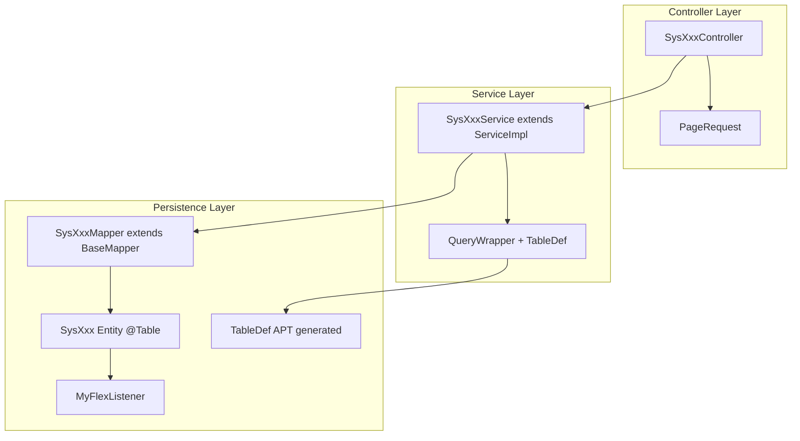

# YXBoot 后端 MyBatis-Flex 开发规范

本文档基于 `yxboot-api` 现有代码总结 MyBatis-Flex 的使用方式、分层约定与实现细节，作为后续后端开发的统一参考。

---

## 1. 技术栈与核心原则

| 项目 | 说明 |
|------|------|
| ORM 框架 | [MyBatis-Flex](https://mybatis-flex.com/) **1.10.9** |
| Spring Boot | 3.x（`mybatis-flex-spring-boot3-starter`） |
| 数据库 | MySQL 8.x |
| 连接池 | Druid |
| 查询方式 | **QueryWrapper + 编译期 TableDef**，不使用 XML Mapper |
| 分层模式 | Entity → Mapper → Service → Controller |

**核心原则：**

1. **零 XML**：所有 SQL 通过 `QueryWrapper` 在 Service 层构建，Mapper 仅继承 `BaseMapper<T>`。
2. **类型安全查询**：优先使用 APT 生成的 `XxxTableDef` 常量，避免手写列名字符串。
3. **Service 即业务入口**：复杂查询、JOIN、条件删除均在 Service 中完成，不在 Mapper 写自定义方法。
4. **不定义 IService 接口**：Service 类直接 `extends ServiceImpl<Mapper, Entity>` 并标注 `@Service`。
5. **审计字段自动填充**：主业务表通过 `MyFlexListener` 在 Insert/Update 时填充 `createTime`、`updateTime`、`createUserId`、`updateUserId`。

---

## 2. 依赖与配置

### 2.1 Maven 依赖

版本在根 `pom.xml` 统一管理：

```xml
<mybatis-flex.version>1.10.9</mybatis-flex.version>
```

`yxboot-api/pom.xml` 引入两个依赖：

```xml
<!-- MyBatis-Flex Starter -->
<dependency>
    <groupId>com.mybatis-flex</groupId>
    <artifactId>mybatis-flex-spring-boot3-starter</artifactId>
    <version>${mybatis-flex.version}</version>
</dependency>

<!-- APT 处理器：编译期生成 TableDef -->
<dependency>
    <groupId>com.mybatis-flex</groupId>
    <artifactId>mybatis-flex-processor</artifactId>
    <version>${mybatis-flex.version}</version>
    <scope>provided</scope>
</dependency>
```

> **注意**：`mybatis-flex-processor` 的 scope 必须为 `provided`，仅在编译时使用，不参与运行时打包。

### 2.2 数据源配置

Flex 通过 Spring Boot Starter 自动装配，**无需**在 `application.yml` 中单独配置 `mybatis-flex:` 块。数据源使用标准 Spring 配置：

```yaml
# application-dev.template.yml
spring:
  datasource:
    url: jdbc:mysql://localhost:3306/yxboot?useUnicode=true&characterEncoding=utf-8&useSSL=false&serverTimezone=GMT%2B8
    username: root
    password: 123456
    type: com.alibaba.druid.pool.DruidDataSource
    driver-class-name: com.mysql.jdbc.Driver
```

### 2.3 Java 配置类

配置类位于 `com.yxboot.config.mybatisflex` 包：

```java
@Configuration
@MapperScan("com.yxboot.modules.**.mapper")
public class MyBatisFlexConfig {

    @PostConstruct
    public void init() {
        // Enable SQL audit
        AuditManager.setAuditEnable(true);

        // Print full SQL and elapsed time (development only)
        AuditManager.setMessageCollector(auditMessage -> {
            System.out.println("SQL: " + auditMessage.getFullSql());
            System.out.println("执行时间: " + auditMessage.getElapsedTime() + " ms");
        });
    }
}
```

**要点：**

- `@MapperScan("com.yxboot.modules.**.mapper")` 扫描所有业务模块下的 Mapper 接口。
- `AuditManager` 用于开发期 SQL 审计，生产环境建议关闭或改为日志框架输出。
- MyBatis-Flex 内置分页能力，**无需**额外注册分页插件。

---

## 3. 项目结构

```
yxboot-api/src/main/java/com/yxboot/
├── config/mybatisflex/              # Flex 专属配置
│   ├── MyBatisFlexConfig.java       # MapperScan + SQL 审计
│   ├── MyFlexListener.java          # Insert/Update 审计字段填充
│   └── handler/
│       └── DictTypeHandler.java     # 自定义 TypeHandler 示例
├── common/
│   ├── pagination/PageRequest.java  # 分页请求 DTO
│   └── enums/                       # 带 @EnumValue 的业务枚举
└── modules/
    └── sys/                         # 系统模块（参考实现）
        ├── entity/                  # 实体类
        ├── mapper/                  # Mapper 接口
        ├── service/                 # Service 实现
        └── controller/              # REST 控制器
```

新增业务模块时，在 `modules/{module}/` 下按相同四层结构组织代码：

```
modules/order/
├── entity/Order.java
├── mapper/OrderMapper.java
├── service/OrderService.java
└── controller/OrderController.java
```

---

## 4. Entity（实体层）

### 4.1 标准业务实体模板

以 `SysUser` 为参考，主业务表实体应包含以下要素：

```java
@Data
@EqualsAndHashCode(callSuper = false)
@Table(value = "sys_user", onInsert = MyFlexListener.class, onUpdate = MyFlexListener.class)
@Schema(name = "SysUser", description = "系统用户表")
public class SysUser implements Serializable {
    @Serial
    private static final long serialVersionUID = 1L;

    @Id(keyType = KeyType.Auto)
    @Schema(description = "用户编号")
    private Long userId;

    @Schema(description = "登录账号")
    private String username;

    // Audit fields — filled by MyFlexListener
    @Schema(description = "创建人")
    private Long createUserId;

    @Schema(description = "创建时间")
    private Date createTime;

    @Schema(description = "更新人")
    private Long updateUserId;

    @Schema(description = "更新时间")
    private Date updateTime;

    // Non-persistent fields for JOIN results or request payload
    @Column(ignore = true)
    private Long roleId;

    @Column(ignore = true)
    private String roleName;
}
```

### 4.2 注解使用规范

| 注解 | 用途 | 示例 |
|------|------|------|
| `@Table(value = "表名")` | 映射数据库表 | `@Table(value = "sys_user")` |
| `@Table(onInsert/onUpdate = MyFlexListener.class)` | 挂载审计字段自动填充 | 主业务表必须挂载 |
| `@Id(keyType = KeyType.Auto)` | 自增主键 | 所有实体主键 |
| `@Column(ignore = true)` | 标记非数据库字段 | JOIN 扩展字段、请求体嵌套对象 |
| `@Column(typeHandler = XxxTypeHandler.class)` | 自定义类型转换 | 字典值 → `Dict` 对象 |

### 4.3 关联表实体（简化模式）

多对多关联表（如 `sys_user_role`）结构简单，**不挂载** `MyFlexListener`：

```java
@Data
@EqualsAndHashCode(callSuper = false)
@Table(value = "sys_user_role")
@Schema(name = "SysUserRole", description = "系统用户角色表")
public class SysUserRole implements Serializable {
    @Serial
    private static final long serialVersionUID = 1L;

    @Id(keyType = KeyType.Auto)
    private Long id;

    private Long userId;
    private Long roleId;
}
```

### 4.4 审计字段约定

主业务表统一包含以下四个审计字段（数据库列名 snake_case，Java 字段 camelCase）：

| Java 字段 | 数据库列 | 填充时机 |
|-----------|----------|----------|
| `createUserId` | `create_user_id` | Insert（当前登录用户） |
| `createTime` | `create_time` | Insert |
| `updateUserId` | `update_user_id` | Insert + Update |
| `updateTime` | `update_time` | Insert + Update |

> **现状说明**：项目未使用 `BaseEntity` 基类，审计字段在各实体中重复声明。新增实体请保持一致。

### 4.5 非持久化字段

以下场景使用 `@Column(ignore = true)`：

1. **JOIN 查询结果扩展字段**（如 `roleName`、`deptName`）
2. **请求/响应中的嵌套对象**（如 `SysRole.menus`）
3. **仅用于前端交互的临时字段**（如 `SysUser.roleId` 用于保存时关联角色）

```java
@Column(ignore = true)
@Schema(description = "关联菜单")
private List<SysMenu> menus;
```

### 4.6 枚举字段映射

枚举类实现 `BaseEnum`，用 `@EnumValue` 标注数据库存储值：

```java
@Getter
public enum StatusEnum implements BaseEnum {
    NORMAL("normal", "正常"),
    INVALID("invalid", "无效");

    @EnumValue
    private String value;
    private String desc;

    StatusEnum(String value, String desc) {
        this.value = value;
        this.desc = desc;
    }

    @JsonCreator(mode = JsonCreator.Mode.DELEGATING)
    public static StatusEnum create(Object value) {
        StatusEnum statusEnum = EnumUtil.likeValueOf(StatusEnum.class, value);
        if (statusEnum == null) {
            throw new ApiException("未找到匹配的枚举值：" + value);
        }
        return statusEnum;
    }
}
```

实体中直接声明枚举类型字段即可，Flex 自动按 `@EnumValue` 映射：

```java
private StatusEnum status;
private MenuEnum type;
```

QueryWrapper 中可直接与枚举比较：

```java
wrapper.where(SYS_MENU.TYPE.eq(MenuEnum.BUTTON));
wrapper.where(SYS_MENU.TYPE.ne(MenuEnum.BUTTON));
wrapper.where(SYS_MENU.TYPE.in(typeList));
```

### 4.7 自定义 TypeHandler

当数据库存字符串、Java 层需要富对象时，实现 `TypeHandler<T>` 并在字段上声明：

```java
@Column(typeHandler = DictTypeHandler.class)
private Dict sex;
```

`DictTypeHandler` 写入时存 `Dict.value`，读取时通过缓存组装完整 `Dict` 对象。新增 TypeHandler 放在 `config/mybatisflex/handler/` 包下。

---

## 5. Mapper（数据访问层）

### 5.1 标准写法

Mapper 接口**仅继承** `BaseMapper<T>`，不声明任何自定义方法：

```java
/**
 * 用户表 Mapper
 */
public interface SysUserMapper extends BaseMapper<SysUser> {

}
```

### 5.2 禁止事项

| 禁止 | 原因 | 替代方案 |
|------|------|----------|
| 在 Mapper 中写 `@Select` / `@Update` 注解 | 与项目零 XML、QueryWrapper 优先原则冲突 | Service 层 `QueryWrapper` |
| 创建 `.xml` Mapper 文件 | 项目不使用 XML | Service 层 `QueryWrapper` |
| 在 Mapper 中声明未实现的方法 | 运行时报错 | 删除或在 Service 用 Wrapper 实现 |

> **遗留问题**：`SysRoleMapper.selectByUserId(Long userId)` 已声明但无实现且无调用，新代码请勿模仿。

---

## 6. Service（业务层）

### 6.1 类声明

```java
@Service
public class SysUserService extends ServiceImpl<SysUserMapper, SysUser> {
    // business methods
}
```

- 直接继承 `ServiceImpl<Mapper, Entity>`，**不**定义 `IService` 接口。
- 通过继承获得 CRUD 快捷方法（见 6.4 节）。

### 6.2 方法命名约定

| 场景 | 命名 | 返回类型 |
|------|------|----------|
| 分页查询 | `pageQuery(...)` | `Page<T>` |
| 列表查询（不分页） | `listQuery(...)` / `query(...)` / `selectAll()` | `List<T>` |
| 按条件查单条 | `selectById(...)` / `selectByUsername(...)` | `T` |
| 按外键查关联 | `selectByRoleId(...)` / `selectByUserId(...)` | `List<T>` |
| 按条件删除 | `removeByUserId(...)` / `removeByRoleId(...)` | `boolean` |

### 6.3 QueryWrapper 使用规范

#### 静态导入 TableDef

每个 Service 文件顶部静态导入对应 TableDef 常量：

```java
import static com.yxboot.modules.sys.entity.table.SysUserTableDef.SYS_USER;
import static com.yxboot.modules.sys.entity.table.SysRoleTableDef.SYS_ROLE;
```

命名规则：`SysUser` 实体 → `SysUserTableDef.SYS_USER` 常量。

#### 模式 A：简单条件查询

```java
public Page<SysRole> pageQuery(String name, String status, PageRequest pageRequest) {
    QueryWrapper wrapper = QueryWrapper.create();
    if (StrUtil.isNotEmpty(name)) {
        wrapper.where(SYS_ROLE.NAME.like(name));
    }
    if (StrUtil.isNotEmpty(status)) {
        wrapper.where(SYS_ROLE.STATUS.eq(status));
    }
    return page(pageRequest.convertToPage(), wrapper);
}
```

**动态条件构建习惯：**

1. 先 `QueryWrapper.create()` 创建空 Wrapper。
2. 用 `StrUtil.isNotEmpty()` / `!= null` / `CollUtil.isNotEmpty()` 判断后再追加 `where`。
3. 多个 `where` 之间默认 AND 关系。

#### 模式 B：多表 JOIN + 字段别名

```java
public Page<SysUser> pageQuery(String name, String phone, Long roleId, String status,
        Integer deptId, PageRequest pageRequest) {
    QueryWrapper wrapper = QueryWrapper.create();
    wrapper.select(SYS_USER.ALL_COLUMNS);
    wrapper.select(SYS_ROLE.ROLE_ID, SYS_ROLE.NAME.as("roleName"));
    wrapper.select(SYS_DEPT.DEPT_ID, SYS_DEPT.NAME.as("deptName"));

    if (StrUtil.isNotEmpty(name)) {
        wrapper.where(SYS_USER.NAME.like(name));
    }
    if (roleId != null) {
        wrapper.where(SYS_USER_ROLE.ROLE_ID.eq(roleId));
    }

    wrapper.leftJoin(SYS_USER_ROLE).on(SYS_USER_ROLE.USER_ID.eq(SYS_USER.USER_ID));
    wrapper.leftJoin(SYS_ROLE).on(SYS_ROLE.ROLE_ID.eq(SYS_USER_ROLE.ROLE_ID));
    wrapper.leftJoin(SYS_DEPT).on(SYS_DEPT.DEPT_ID.eq(SYS_USER.DEPT_ID));
    wrapper.orderBy(SYS_USER.USER_ID, false);

    return page(pageRequest.convertToPage(), wrapper);
}
```

**JOIN 要点：**

- 使用 `select(表.ALL_COLUMNS)` 选取主表全部列。
- 关联表字段用 `.as("别名")` 映射到实体的 `@Column(ignore = true)` 字段。
- JOIN 类型统一使用 `leftJoin`。
- 条件字段来自关联表时，确保 JOIN 已添加。

#### 模式 C：自连接（表别名）

```java
public List<SysMenu> selectAll() {
    SysMenuTableDef parent = SYS_MENU.as("parent");

    QueryWrapper wrapper = QueryWrapper.create();
    wrapper.select(SYS_MENU.ALL_COLUMNS);
    wrapper.select(parent.NAME.as("parentName"));
    wrapper.leftJoin(parent).on(SYS_MENU.PARENT_ID.eq(parent.MENU_ID));
    wrapper.orderBy(SYS_MENU.SORT, true);

    return list(wrapper);
}
```

#### 模式 D：条件删除

```java
public boolean removeByUserId(Long userId) {
    QueryWrapper wrapper = QueryWrapper.create();
    wrapper.where(SYS_USER_ROLE.USER_ID.eq(userId));
    return remove(wrapper);
}
```

#### 常用 QueryWrapper API

| API | 说明 | 示例 |
|-----|------|------|
| `.where(col.eq(val))` | 等值 | `SYS_USER.USER_ID.eq(userId)` |
| `.where(col.like(val))` | 模糊 | `SYS_ROLE.NAME.like(name)` |
| `.where(col.in(list))` | IN | `SYS_ROLE_MENU.ROLE_ID.in(roleIds)` |
| `.where(col.ne(val))` | 不等 | `SYS_MENU.TYPE.ne(MenuEnum.BUTTON)` |
| `.orderBy(col, asc)` | 排序 | `SYS_LOG.CREATE_TIME, false`（false = DESC） |
| `.leftJoin(table).on(...)` | 左连接 | 见上文示例 |
| `.select(...)` | 指定查询列 | `SYS_USER.ALL_COLUMNS` |

### 6.4 ServiceImpl 内置 CRUD 方法

| 方法 | 用途 | 典型场景 |
|------|------|----------|
| `page(page, wrapper)` | 分页查询 | 列表页 |
| `list(wrapper)` | 列表查询 | 下拉选项、树形数据 |
| `getOne(wrapper)` | 查单条 | 按用户名查用户 |
| `getById(id)` | 按主键查 | 详情页 |
| `save(entity)` | 新增 | 单条插入 |
| `saveBatch(list)` | 批量新增 | 角色-菜单关联 |
| `saveOrUpdate(entity)` | 新增或更新 | 保存表单（按主键判断） |
| `removeById(id)` | 按主键删除 | 单条删除 |
| `removeByIds(ids)` | 批量删除 | 删除子按钮 |
| `remove(wrapper)` | 按条件删除 | 清除关联关系 |
| `page(page)` | 无条件下分页 | 简单列表 |

### 6.5 更新策略

项目**不使用** `UpdateWrapper`。更新统一通过以下方式：

1. **实体 set 后 saveOrUpdate**（最常用）：

```java
SysUser sysUser = getById(userId);
sysUser.setPassword(passwordEncoder.encode(password));
saveOrUpdate(sysUser);
```

2. **Controller 层合并后 saveOrUpdate**（部分更新）：

```java
SysUser dbUser = sysUserService.getById(sysUser.getUserId());
BeanUtil.copyProperties(sysUser, dbUser, CopyOptions.create().ignoreNullValue());
sysUserService.saveOrUpdate(dbUser);
```

`MyFlexListener.onUpdate` 会自动刷新 `updateTime` 和 `updateUserId`。

---

## 7. 分页

### 7.1 PageRequest DTO

```java
@Data
public class PageRequest {
    private Long pageNumber = 1L;
    private Long pageSize = 20L;
    private String field;   // reserved, not wired yet
    private String order;   // reserved, not wired yet

    public <T> Page<T> convertToPage() {
        return Page.of(pageNumber, pageSize);
    }
}
```

### 7.2 调用链

```
GET /sys/user/list?pageNumber=1&pageSize=20&name=张三
  ↓ Spring 自动绑定
Controller 接收 PageRequest + 查询参数
  ↓
Service.pageQuery(..., pageRequest)
  ↓
page(pageRequest.convertToPage(), wrapper)
  ↓
返回 Page<T>（含 records、totalRow、pageNumber、pageSize 等）
  ↓
Controller 包装为 Result<Page<T>>
```

### 7.3 Controller 示例

```java
@GetMapping("/list")
public Result<Page<SysUser>> list(String name, String phone, Long roleId,
        String status, Integer deptId, PageRequest pageRequest) {
    Page<SysUser> pageResult = sysUserService.pageQuery(
            name, phone, roleId, status, deptId, pageRequest);
    return Result.success("查询成功！", pageResult);
}
```

### 7.4 排序约定

当前排序在 Service 内硬编码，例如：

```java
wrapper.orderBy(SYS_LOG.CREATE_TIME, false);  // 按创建时间倒序
wrapper.orderBy(SYS_MENU.SORT, true);          // 按排序字段升序
```

`PageRequest.field` / `PageRequest.order` 已预留但未接入，如需前端动态排序需扩展 `convertToPage()` 或在 Service 中解析。

---

## 8. Controller 与 Service 协作

### 8.1 REST 端点约定

| 方法 | 路径 | 说明 |
|------|------|------|
| `GET` | `/list` | 分页列表 |
| `GET` | `/all` | 全量列表（不分页） |
| `GET` | `/get` | 详情（`@RequestParam` 传主键） |
| `POST` | `/save` | 新增/更新 |
| `DELETE` | `/remove` | 删除 |

路径前缀：`/sys/{resource}`，如 `/sys/user`、`/sys/role`。

### 8.2 保存主表 + 关联表

用户保存（主表 + 用户角色关联）：

```java
@PostMapping("/save")
public Result<SysUser> save(@RequestBody SysUser sysUser) {
    // ... validation ...
    sysUserService.saveOrUpdate(sysUser);

    Long roleId = sysUser.getRoleId();
    if (roleId != null) {
        sysUserRoleService.removeByUserId(sysUser.getUserId());
        SysUserRole userRole = new SysUserRole();
        userRole.setUserId(sysUser.getUserId());
        userRole.setRoleId(roleId);
        sysUserRoleService.save(userRole);
    }
    return Result.success("保存成功！", sysUser);
}
```

角色保存（主表 + 批量关联菜单）：

```java
@PostMapping("/save")
public Result<SysRole> save(@RequestBody SysRole sysRole) {
    sysRoleService.saveOrUpdate(sysRole);
    sysRoleMenuService.removeByRoleId(sysRole.getRoleId());

    List<SysMenu> menus = sysRole.getMenus();
    if (CollUtil.isNotEmpty(menus)) {
        List<SysRoleMenu> roleMenus = new ArrayList<>();
        for (SysMenu menu : menus) {
            SysRoleMenu sysRoleMenu = new SysRoleMenu();
            sysRoleMenu.setRoleId(sysRole.getRoleId());
            sysRoleMenu.setMenuId(menu.getMenuId());
            roleMenus.add(sysRoleMenu);
        }
        sysRoleMenuService.saveBatch(roleMenus);
    }
    return Result.success("保存成功！", sysRole);
}
```

### 8.3 级联删除

菜单删除前先校验子级、再批量删除关联按钮：

```java
@DeleteMapping("/remove")
public Result<Void> remove(Long menuId) {
    List<SysMenu> children = sysMenuService.queryByParentId(menuId);
    if (CollUtil.isNotEmpty(children)) {
        return Result.error("删除失败！当前菜单下有子级菜单不可删除");
    }
    SysMenu sysMenu = sysMenuService.getById(menuId);
    if (sysMenu.getType() == MenuEnum.MENU) {
        List<SysMenu> buttons = sysMenuService.queryByParentIdAndBooton(menuId);
        sysMenuService.removeByIds(
                buttons.stream().map(SysMenu::getMenuId).collect(Collectors.toList()));
    }
    sysMenuService.removeById(menuId);
    return Result.success("删除成功！");
}
```

---

## 9. 审计字段自动填充（MyFlexListener）

### 9.1 实现原理

`MyFlexListener` 实现 `InsertListener` 和 `UpdateListener`，通过反射按字段名填充：

```java
public class MyFlexListener implements InsertListener, UpdateListener {

    @Override
    public void onInsert(Object entity) {
        setFieldValue(entity, "createTime", LocalDateTime.now());
        setFieldValue(entity, "updateTime", LocalDateTime.now());
        Long userId = UserUtil.getCurrentUserId();
        if (userId != null) {
            setFieldValue(entity, "createUserId", userId);
            setFieldValue(entity, "updateUserId", userId);
        }
    }

    @Override
    public void onUpdate(Object entity) {
        setFieldValue(entity, "updateTime", LocalDateTime.now());
        Long userId = UserUtil.getCurrentUserId();
        if (userId != null) {
            setFieldValue(entity, "updateUserId", userId);
        }
    }

    private void setFieldValue(Object entity, String fieldName, Object value) {
        // Only set when field exists and current value is null
    }
}
```

### 9.2 挂载方式

在 `@Table` 注解上指定：

```java
@Table(value = "sys_user", onInsert = MyFlexListener.class, onUpdate = MyFlexListener.class)
```

### 9.3 挂载范围

| 实体类型 | 是否挂载 MyFlexListener |
|----------|------------------------|
| 主业务表（sys_user、sys_role、sys_menu 等） | **是** |
| 关联表（sys_user_role、sys_role_menu） | **否** |
| 日志表（sys_log） | **是** |

### 9.4 注意事项

- Listener 使用 `LocalDateTime`，实体字段使用 `java.util.Date`，依赖 JDBC 类型转换。
- 仅当字段值为 `null` 时才写入，已有值不会被覆盖。
- 字段不存在时静默忽略，不会抛异常。

---

## 10. TableDef 编译期生成

### 10.1 生成机制

- 依赖 `mybatis-flex-processor`（APT），Maven 编译时自动生成。
- 生成路径：`target/generated-sources/annotations/com/yxboot/modules/{module}/entity/table/`。
- **源码不在版本库中**，IDE 需执行 Maven Compile 后才能识别。

### 10.2 命名规则

| 实体类 | TableDef 类 | 常量名 |
|--------|-------------|--------|
| `SysUser` | `SysUserTableDef` | `SYS_USER` |
| `SysRoleMenu` | `SysRoleMenuTableDef` | `SYS_ROLE_MENU` |

### 10.3 使用方式

```java
import static com.yxboot.modules.sys.entity.table.SysUserTableDef.SYS_USER;

// Column reference
SYS_USER.USER_ID
SYS_USER.NAME
SYS_USER.ALL_COLUMNS

// Table alias for self-join
SysMenuTableDef parent = SYS_MENU.as("parent");
```

### 10.4 IDE 提示

若 IDE 报 `SysUserTableDef` 找不到：

```bash
cd yxboot-api && mvn compile -DskipTests
```

然后在 IDE 中 Refresh / Reimport Maven Project。

---

## 11. 数据库表设计约定

与 MyBatis-Flex 实体映射保持一致：

| 约定 | 示例 |
|------|------|
| 表名 | `sys_{entity}` snake_case：`sys_user`、`sys_role_menu` |
| 主键列 | 业务语义 + `_id`：`user_id`、`dept_id`、`menu_id` |
| 关联表主键 | 统一用 `id` |
| 列名 | snake_case：`create_user_id`、`create_time` |
| Java 字段 | camelCase（Flex 默认驼峰映射）：`createUserId`、`createTime` |
| 主键策略 | `AUTO_INCREMENT`，实体 `@Id(keyType = KeyType.Auto)` |
| 状态字段 | `varchar(20)` 存枚举 value：`normal`、`invalid` |

标准建表模板（主业务表）：

```sql
CREATE TABLE `sys_xxx` (
  `xxx_id` bigint(20) NOT NULL AUTO_INCREMENT COMMENT '编号',
  -- business columns ...
  `create_user_id` bigint(20) DEFAULT NULL COMMENT '创建人',
  `create_time` datetime DEFAULT NULL COMMENT '创建时间',
  `update_user_id` bigint(20) DEFAULT NULL COMMENT '更新人',
  `update_time` datetime DEFAULT NULL COMMENT '更新时间',
  `status` varchar(20) DEFAULT NULL COMMENT '状态',
  PRIMARY KEY (`xxx_id`)
) ENGINE=InnoDB DEFAULT CHARSET=utf8mb4 COMMENT='xxx表';
```

---

## 12. 命名规范汇总

| 层级 | 规范 | 示例 |
|------|------|------|
| 包路径 | `com.yxboot.modules.{module}.{layer}` | `modules.sys.service` |
| 表名 | `sys_{name}` snake_case | `sys_user` |
| 实体类 | `Sys{Entity}` PascalCase | `SysUser` |
| Mapper | `Sys{Entity}Mapper` | `SysUserMapper` |
| Service | `Sys{Entity}Service` | `SysUserService` |
| Controller | `Sys{Entity}Controller` | `SysUserController` |
| REST 路径 | `/sys/{resource}` | `/sys/user` |
| TableDef 常量 | `SYS_{ENTITY}` 全大写 | `SYS_USER.USER_ID` |
| 主键字段 | 业务名 + Id | `userId`、`roleId`（关联表用 `id`） |

---

## 13. 新模块开发 Checklist

以新增 `sys_notice`（通知）为例：

### Step 1：建表

在 `src/main/resources/sql/yxboot.sql` 添加 DDL，遵循第 11 节约定。

### Step 2：创建 Entity

```
modules/sys/entity/SysNotice.java
```

- `@Table(value = "sys_notice", onInsert = MyFlexListener.class, onUpdate = MyFlexListener.class)`
- `@Id(keyType = KeyType.Auto)` + 主键字段
- 四个审计字段
- 按需添加 `@Column(ignore = true)` 扩展字段

### Step 3：创建 Mapper

```
modules/sys/mapper/SysNoticeMapper.java
```

```java
public interface SysNoticeMapper extends BaseMapper<SysNotice> {
}
```

### Step 4：编译生成 TableDef

```bash
mvn compile -DskipTests
```

### Step 5：创建 Service

```
modules/sys/service/SysNoticeService.java
```

```java
@Service
public class SysNoticeService extends ServiceImpl<SysNoticeMapper, SysNotice> {

    public Page<SysNotice> pageQuery(String title, String status, PageRequest pageRequest) {
        QueryWrapper wrapper = QueryWrapper.create();
        if (StrUtil.isNotEmpty(title)) {
            wrapper.where(SYS_NOTICE.TITLE.like(title));
        }
        if (StrUtil.isNotEmpty(status)) {
            wrapper.where(SYS_NOTICE.STATUS.eq(status));
        }
        wrapper.orderBy(SYS_NOTICE.CREATE_TIME, false);
        return page(pageRequest.convertToPage(), wrapper);
    }
}
```

### Step 6：创建 Controller

```
modules/sys/controller/SysNoticeController.java
```

按第 8 节 REST 约定暴露 `/list`、`/get`、`/save`、`/remove`。

---

## 14. 架构总览



---

## 15. 当前项目特征与改进建议

以下为现有代码的真实状态，新开发时需了解：

| 特征 | 现状 | 建议 |
|------|------|------|
| 软删除 | 未实现，均为物理删除 | 如需软删除，引入 `@Column(isLogicDelete = true)` + Flex 逻辑删除配置 |
| 多租户 | 未实现 | 如需多租户，配置 `TenantFactory` |
| 事务 | 全项目无 `@Transactional` | 跨 Service 写操作（如 save 主表 + 关联表）建议加 `@Transactional` |
| IService 接口 | 未使用 | 保持现状，不引入额外接口层 |
| XML Mapper | 零 XML | 保持现状 |
| BaseEntity | 未使用 | 可选：抽取审计字段基类减少重复 |
| 动态排序 | PageRequest 已预留未接入 | 按需扩展 |

---

## 16. 参考文件索引

| 用途 | 路径 |
|------|------|
| Flex 配置 | `yxboot-api/src/main/java/com/yxboot/config/mybatisflex/MyBatisFlexConfig.java` |
| 审计 Listener | `yxboot-api/src/main/java/com/yxboot/config/mybatisflex/MyFlexListener.java` |
| TypeHandler 示例 | `yxboot-api/src/main/java/com/yxboot/config/mybatisflex/handler/DictTypeHandler.java` |
| 分页 DTO | `yxboot-api/src/main/java/com/yxboot/common/pagination/PageRequest.java` |
| 实体参考 | `yxboot-api/src/main/java/com/yxboot/modules/sys/entity/SysUser.java` |
| 简单查询 | `yxboot-api/src/main/java/com/yxboot/modules/sys/service/SysRoleService.java` |
| 多表 JOIN | `yxboot-api/src/main/java/com/yxboot/modules/sys/service/SysUserService.java` |
| 自连接 | `yxboot-api/src/main/java/com/yxboot/modules/sys/service/SysMenuService.java` |
| 条件删除 | `yxboot-api/src/main/java/com/yxboot/modules/sys/service/SysUserRoleService.java` |
| 保存 + 关联 | `yxboot-api/src/main/java/com/yxboot/modules/sys/controller/SysUserController.java` |
| 批量保存 | `yxboot-api/src/main/java/com/yxboot/modules/sys/controller/SysRoleController.java` |
| 级联删除 | `yxboot-api/src/main/java/com/yxboot/modules/sys/controller/SysMenuController.java` |
| 枚举映射 | `yxboot-api/src/main/java/com/yxboot/common/enums/StatusEnum.java` |
| DB Schema | `yxboot-api/src/main/resources/sql/yxboot.sql` |

---

## 17. 常见问题

### Q1：IDE 提示 `SysUserTableDef` 无法解析？

执行 `mvn compile -DskipTests` 生成 TableDef，然后 Refresh Maven Project。

### Q2：新增实体后查询报列不存在？

检查实体字段名与数据库列名是否遵循 camelCase ↔ snake_case 映射；特殊映射用 `@Column("column_name")` 显式指定。

### Q3：saveOrUpdate 后主键 ID 为空？

Flex 的 `save` 会自动回填自增主键到实体对象。确保 `@Id(keyType = KeyType.Auto)` 正确配置。

### Q4：JOIN 查询结果中扩展字段为 null？

确认：1) `select` 中使用了 `.as("别名")`；2) 实体中有对应的 `@Column(ignore = true)` 字段；3) 别名与 Java 字段名一致（camelCase）。

### Q5：审计字段没有自动填充？

确认：1) 实体 `@Table` 挂载了 `MyFlexListener`；2) 当前请求有登录用户（`UserUtil.getCurrentUserId()` 非 null）；3) 字段值为 null（已有值不会被覆盖）。
